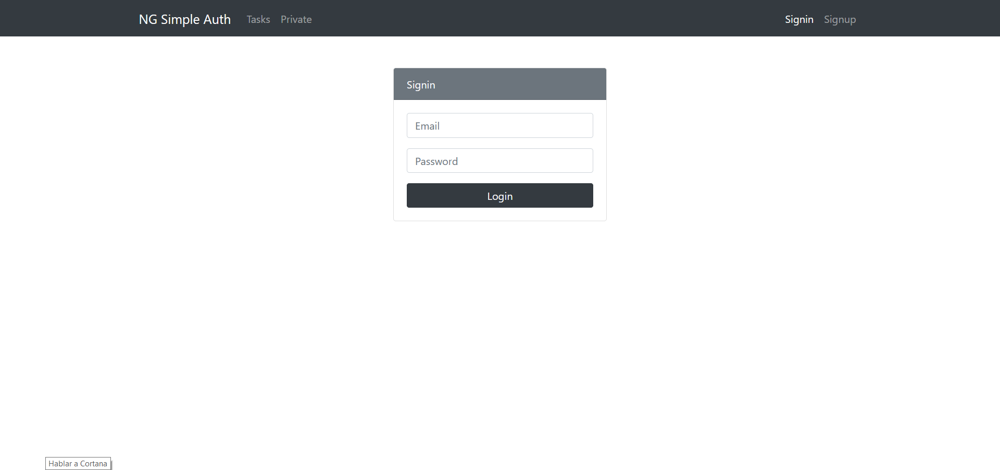

## Integration of NodeJs and Angular

**Remember to install the npm packages in the backend**
````
npm install
````
**And initialize the server in angular**
````
ng serve
````

**Features:** 
 - Api Rest running
 - Consumption of this Api by angular through HttpClient module
 - Authentication with JsonWebToken (JWT)

**Screenshot**

